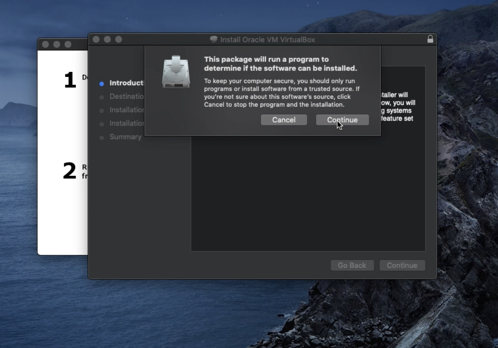

This is a continuation of the post
Why would one learn Linux in the first place?
[Intro to Linux ](https://zendannyy.github.io/seventh_post/)

### Get setup with Linux 
Setup instructions 
*This was done on MacOS but the instructions are left a bit general since they don't differ much for OSes*
 
Please install the following
 
[Vagrant](https://www.vagrantup.com/downloads)
 
[Virtualbox](https://www.virtualbox.org/wiki/Downloads)

Vagrant uses a base image to quickly clone a virtual machine, and saves time and resources in the
installation process. This is faster than setting up a virtual machine manually through a virtual box 
 
 
Virtualbox is the virtualization software that we will use, it is free and platform agnostic.
Download the insaller and follow the prompts as shown below

<!--  -->

Once you get output at the terminal with the following command, you have a successful installation

vagrant -h
 

I like Vagrant for its catalog of box OSes. It's also fairly fast and much more performant than using a local VM on your host machine. 
